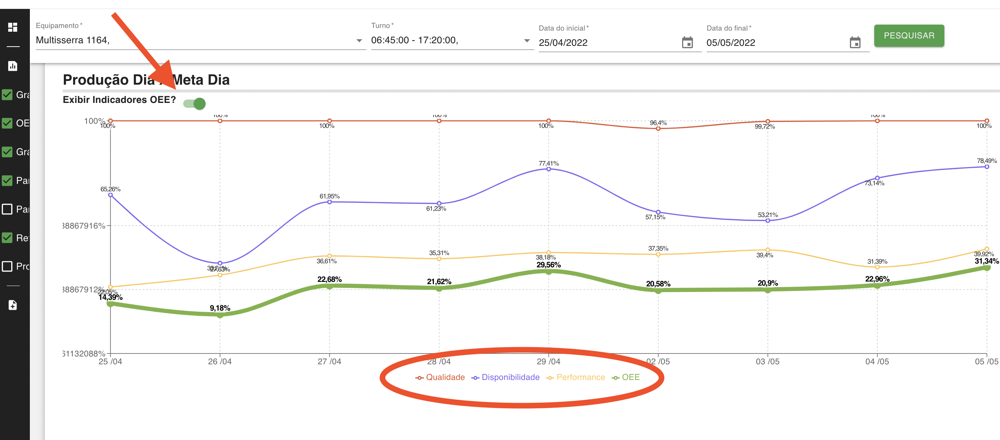

### Novidades nos relatórios do sistema VieliTech

Apesar do Blog do sistema de apontamento da VieliTech não estar muito ativo nos últimos meses, estamos trabalhando constantemente em melhorias do Sistema.

Essa semana (02/05), estamos fazendo melhorias nas telas dos relatórios do sistema de apontamento conforme solicitações de usuários. A principal dela é a adição do relatório de OEE junto ao gráfico de "Produção Dia x Meta Dia". Foi adicionado um botão para exibir os indicadores de OEE. Selecionando essa opção, o gráfico de producão será substituido pelos indicadores de OEE.

Também foi feito melhorias no gráfico, mudando a formatação dos números no gráfico pera atenuar situações de sobreposição dos números e melhorar a visualização. Assim como no relatório detalhado de paradas foi incluido a data e hora do fim da parada.

Caso tenham melhorias de sistema ou sugestões, enviem um email para contato@vielitech.com.br ou acesse o formulário https://forms.gle/DSK64itAn7yPxoHx8